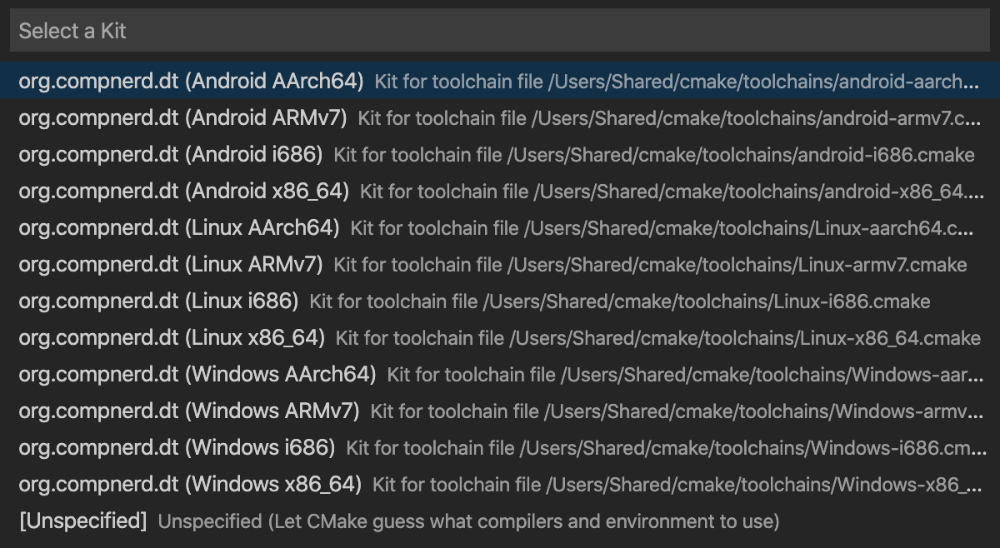
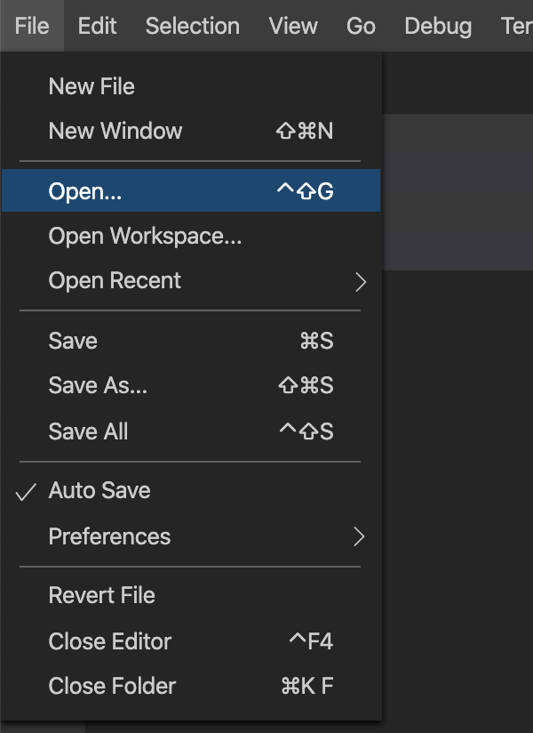

# **//swift/build**

## Table of Contents

- [**//swift/build**](#--swift-build---)
  * [Getting Started (Docker)](#getting-started--Docker-)
    + [Hello World (CMake)](#minimal-hello-world--cmake-)
    + [Windows](#windows)
  * [Status](#status)

## Getting Started (Docker)

Getting started is as simple as running a command from your shell:
```Shell
$ docker run --rm --publish 127.0.0.1:8080:8080 --volume $HOME/projects/myproject:/SourceCache/myproject --volume $HOME/projects/bin/myproject:/BinaryCache/myproject compnerd/swift:latest
```

* The docker image doesn't require persistent state, so we use `--rm` to automatically clean up and remove the container when it exits.
* Visual Studio Code is exposed over a web interface on port 8080. We publish this port via `--publish 127.0.0.1:8080:8080` <sup>[\*](#footnote1)</sup>.
* `--volume $HOME/projects/myproject:/SourceCache/myproject` and `--volume $HOME/projects/bin/myproject:/BinaryCache/myproject` mount your source tree for "myproject" into the docker image as a subdirectory of `/SourceCache` and the directory for compiled output into it as `/BinaryCache`.
* `compnerd/swift` references the latest tag on [Docker Hub](https://hub.docker.com/r/compnerd/swift).

<a name="footnote1">\*</a> If you'd like to access this from anywhere other than localhost, you can replace this with `--publish 0.0.0.0:8080:8080`, but no authentication or HTTPS are configured, so doing this with no additional configuration will be insecure.

### Minimal Hello World (CMake)

First, clone the examples repository:

```Shell
$ git clone https://github.com/compnerd/swift-windows-examples.git
```

Next, make a directory for the binary output (remember to substitute your own path!):
```Shell
$ mkdir -p $HOME/bin/HelloMinimal-CMake
```

Next start up the build environment:

```Shell
$ docker run --rm --publish 127.0.0.1:8080:8080 --volume /path/to/swift-windows-examples/HelloMinimal-CMake:/SourceCache/HelloMinimal-CMake --volume $HOME/bin/HelloMinimal-CMake:/BinaryCache/HelloMinimal-CMake compnerd/swift:latest
```

Navigate to localhost in your browser: http://127.0.0.1:8080/. Or, if you want to open a workspace directly, you can provide a path: http://localhost:8080/?folder=/SourceCache/HelloMinimal-CMake

Visual Studio Code will prompt you to configure your project with CMake - choose "Yes".


You will be offered a selection of CMake Kits. This dictates the target system that this session will build. For this example, select "Linux x86_64".



You may be asked whether Visual Studio Code should always configure CMake projects upon opening. You can choose either "Yes" or "For this Workspace"; all this does is add a setting to `.vscode/settings.json`. Because we run a fresh image on each run of the docker container, You will need to click "Yes" on each new run of the container, or "For this Workspace" to do so automatically your current workspace. Note that you will still have to select your desired CMake Kit on each startup.


If you did not open Visual Studio Code with the "folder" URL parameter, click File -> Open... to do so and choose `/SourceCache/HelloMinimal-CMake`. By default, `/SourceCache` will be opened, but this will not necessarily set up a working CMake project in a subdirectory. Hit "Enter".




Once you do so, you should see `CMakeLists.txt`, `hello.swift`, `hikit.swift`, and, if you chose "For this Workspace", a `.vscode` directory.


At the bottom of the screen, your toolbar will have CMake information. Ensure that the "Linux x86_64" kit is selected, and click the "Build:" button (in the future, if you want to rebuild only specific CMake targets, you can click "\[all\]" and select them specifically).


Your program is now compiled; now let's test it out. Open a shell with "Ctrl-`" (Ctrl-Backtick), and run it with:

```Shell
$ /BinaryCache/HelloMinimal-CMake/Debug/hello
```


Congratulations! You've built and run your first Swift program with swift-build-configuration!

### Windows
See documentation [here](docs/Windows.md)

## Status

**Dependencies**

| Build | Status |
| :-: | - |
| **CURL** | [](https://compnerd.visualstudio.com/swift-build/_build/latest?definitionId=11&branchName=master) |
| **ICU** | [](https://compnerd.visualstudio.com/swift-build/_build/latest?definitionId=9&branchName=master) |
| **SQLite3** | [](https://compnerd.visualstudio.com/swift-build/_build/latest?definitionId=12&branchName=master) |
| **TensorFlow** | [](https://dev.azure.com/compnerd/swift-build/_build/latest?definitionId=44&branchName=master) |
| **XML2** | [](https://compnerd.visualstudio.com/swift-build/_build/latest?definitionId=10&branchName=master) |
| **ZLIB** | [](https://compnerd.visualstudio.com/swift-build/_build/latest?definitionId=16&branchName=master) |

**Swift 5.2**

| Build | Status |
| :-: | - |
| **VS2017** | [](https://compnerd.visualstudio.com/swift-build/_build/latest?definitionId=30&branchName=master) |
| **VS2019** | [](https://compnerd.visualstudio.com/swift-build/_build/latest?definitionId=43&branchName=master) |

***NOTE**: The VS2017 builds are for testing purposes, please use the VS2019 builds*
<details>
  <summary>Build Contents</summary>

  - **VS2019**
    - *Toolchain*
      - X64
      - ARM64
    - *Swift SDK for Windows*
      - ARM
      - ARM64
      - X64
      - X86
    - *Swift SDK for Android*
      - ARM
      - ARM64
      - X64
      - X86
 </details>

**Swift HEAD (Development)**

| Build | Status |
| :-: | - |
| **macOS** | [](https://dev.azure.com/compnerd/swift-build/_build/latest?definitionId=15&branchName=master) |
| **VS2017** | [](https://dev.azure.com/compnerd/swift-build/_build/latest?definitionId=1&branchName=master) |
| **VS2019** | [](https://dev.azure.com/compnerd/swift-build/_build/latest?definitionId=7&branchName=master) |
| **VS2017 (Facebook)** | [?branchName=master)](https://compnerd.visualstudio.com/swift-build/_build/latest?definitionId=5&branchName=master) |
| **VS2019 (Facebook)** | [?branchName=master)](https://compnerd.visualstudio.com/swift-build/_build/latest?definitionId=31&branchName=master) |
| **Ubuntu 18.04 (FlowKey)** | [?branchName=master)](https://compnerd.visualstudio.com/swift-build/_build/latest?definitionId=14&branchName=master) |

<details>
  <summary>Build Contents</summary>

  - **macOS**
    - *Toolchain (llvm, clang, lld, lldb, swift)*
      - X64
    - *xctoolchain*
      - X64

  - **VS2017**
    - *Toolchain (llvm, clang, lld, lldb, swift)*
      - X64
  
  - **VS2019**
    - *Toolchain (llvm, clang, lld, lldb, swift)*
      - ARM64
      - X86
    - *Swift SDK for Android (swift, libdispatch, foundation, xctest)*
      - ARM
      - ARM64
      - X64
      - X86
    - *Swift SDK for Windows (swift, libdispatch, foundation, xctest)*
      - ARM
      - ARM64
      - X64
      - X86
    - *Swift Developer Tools (llbuild)*
      - ARM64
      - X64
    - *MSI*
      - Toolchain
        - X64

  - **VS2017 (Facebook)**
    - *Toolchain (llvm, clang, lld, lldb, swift)*
      - X64
    - Swift SDK for Windows (swift, libdispatch, foundation, xctest)
      - ARM
      - ARM64
      - X64
      - X86

  - **VS2019 (Facebook)**
    - *Toolchain (llvm, clang, lld, lldb, swift)*
      - X64
    - *Swift SDK for Windows (libdispatch, foundation, xctest)*
      - ARM
      - ARM64
      - X64
      - X86

  - **Ubuntu 18.04 (FlowKey)**
    - *Toolchain (llvm, clang, lld, lldb, swift)*
      - X64
    - *Swift SDK for Linux (swift, libdispatch, foundation, xctest)*
      - X64
    - *Swift Developer Tools (llbuild, swift-package-manager)*
      - X64
    - *debian packages*
      - toolchain
        - X64
      - ICU
        - X64
      - Developer Tools
        - X64
      - SDK
        - Linux
</details>
